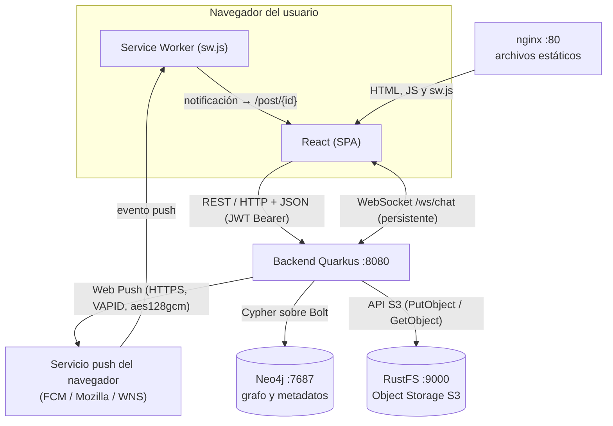

# Red Social Distribuida

Aplicación web distribuida que implementa las funcionalidades esenciales de una red social. El objetivo es **diseñar, implementar y justificar una arquitectura distribuida**: cada componente tiene una responsabilidad clara y se comunica mediante el mecanismo adecuado (REST, WebSocket, Web Push, Cypher, API S3).

Proyecto de la asignatura Sistemas Distribuidos.

---

## Índice

1. [Integrantes](#1-integrantes)
2. [Estado del proyecto](#2-estado-del-proyecto)
3. [Arquitectura](#3-arquitectura)
4. [Tecnologías](#4-tecnologías)
5. [Requisitos previos](#5-requisitos-previos)
6. [Puesta en marcha con Docker](#6-puesta-en-marcha-con-docker-) ⭐ Recomendado
7. [Puesta en marcha (modo dev local)](#7-puesta-en-marcha-modo-dev-local)
8. [Uso diario](#8-uso-diario)
9. [Variables de entorno](#9-variables-de-entorno)
10. [Puertos usados](#10-puertos-usados)
11. [Estructura del repositorio](#11-estructura-del-repositorio)
12. [API REST (endpoints)](#12-api-rest-endpoints)
13. [Modelo del grafo](#13-modelo-del-grafo)
14. [Consultas Cypher](#14-consultas-cypher)
15. [Uso de REST](#15-uso-de-rest)
16. [Uso de WebSocket](#16-uso-de-websocket)
17. [Uso de Web Push](#17-uso-de-web-push)
18. [Decisiones técnicas](#18-decisiones-técnicas)
19. [Guion de demostración](#19-guion-de-demostración)
20. [Flujo de trabajo en Git](#20-flujo-de-trabajo-en-git)
21. [Solución de problemas](#21-solución-de-problemas)

---

## 1. Integrantes

| Integrante | Usuario GitHub | Área principal |
|---|---|---|
| _Nombre 1_ | @usuario1 | A. Usuarios y grafo social |
| _Nombre 2_ | @usuario2 | B. Contenido, S3, feed y reacciones |
| _Nombre 3_ | @usuario3 | C. Chat en tiempo real (WebSocket) |
| _Nombre 4_ | @usuario4 | D. Infraestructura, Web Push, diagrama y documentación |

> Completar con los datos reales del equipo.

---

## 2. Estado del proyecto

- [x] Infraestructura: Neo4j y almacenamiento S3 con Docker Compose
- [x] Backend base con Quarkus
- [x] Registro e inicio de sesión (bcrypt + JWT)
- [x] Perfiles de usuario (consultar y editar)
- [x] Grafo social: seguir, seguidores, seguidos y sugerencias
- [x] Publicaciones con imagen en S3
- [x] Feed personalizado y reacciones
- [x] Chat en tiempo real (WebSocket)
- [x] Notificaciones Web Push
- [x] Frontend React
- [x] Dockerización completa (backend y frontend en contenedores)

---

## 3. Arquitectura

El diagrama refleja exactamente lo que hace el código (también está en [docs/arquitectura.md](docs/arquitectura.md) y como imagen en [docs/arquitectura.png](docs/arquitectura.png)).



**Quién habla con quién y cómo:**

| Origen → Destino | Mecanismo | Para qué | Código |
|---|---|---|---|
| React → Quarkus | REST / HTTP + JSON, token JWT en `Authorization` | Registro, login, perfiles, seguir, posts, feed, reacciones, historial del chat | `frontend/src/api/client.js`, `*Resource.java` |
| React ↔ Quarkus | WebSocket `/ws/chat` (conexión persistente, bidireccional) | Enviar y recibir mensajes en tiempo real | `frontend/src/pages/Chat.jsx`, `chat/ChatSocket.java` |
| Quarkus → Neo4j | Cypher sobre el protocolo Bolt | Usuarios, relaciones `SIGUE`/`PUBLICA`/`REACCIONA`, mensajes y suscripciones | `*Repository.java` |
| Quarkus → RustFS | API S3 | Guardar y leer las imágenes de los posts | `posts/AlmacenamientoService.java` |
| Quarkus → Servicio push | Protocolo Web Push (HTTPS + VAPID) | Avisar a los seguidores cuando alguien publica | `push/WebPushService.java` |
| Servicio push → Service Worker | Evento `push` del navegador | Mostrar la notificación aunque la app esté cerrada | `frontend/public/sw.js` |

**Dónde vive cada dato:**

| Dato | Dónde | Por qué |
|---|---|---|
| Usuarios, quién sigue a quién, posts (texto, fecha, autor), reacciones, conversaciones y mensajes | Neo4j | Son entidades y relaciones: se consultan recorriendo el grafo |
| Imagen de un post | RustFS (S3), bucket `posts-media` | Los binarios no pertenecen a una base de grafos |
| Enlace entre el post y su imagen | Neo4j, propiedad `Post.mediaKey` (solo la clave, p. ej. `3f2a….png`) | Es lo único necesario para localizar el objeto |
| Suscripciones push (`endpoint`, `p256dh`, `auth`) | Neo4j, nodo `(:Suscripcion)` | El backend necesita saber a qué navegadores avisar |
| Sesión | En el navegador (JWT en `localStorage`) | El backend no guarda estado de sesión |

El navegador nunca habla directamente con Neo4j ni con RustFS: las imágenes se piden al backend (`GET /media/{clave}`), que las lee de S3.

| Necesidad | Mecanismo | Componente |
|---|---|---|
| Operaciones CRUD y consultas | REST / HTTP + JSON | Quarkus |
| Relaciones sociales | Base de datos de grafos (Cypher) | Neo4j |
| Archivos de las publicaciones | Object Storage (API S3) | RustFS |
| Mensajería bidireccional | WebSocket | Quarkus |
| Notificaciones fuera de la app | Web Push | Quarkus + Service Worker |
| Despliegue reproducible | Contenedores | Docker Compose |

---

## 4. Tecnologías

| Componente | Tecnología |
|---|---|
| Frontend | React (Vite) |
| Backend | Quarkus 3.39 + Java 21 + Maven |
| Base de datos de grafos | Neo4j 5 Community |
| Almacenamiento de archivos | RustFS (compatible con S3) |
| Autenticación | JWT (RSA) + bcrypt |
| Tiempo real | WebSocket (`quarkus-websockets-next`) |
| Notificaciones | Web Push (VAPID) |
| Contenedores | Docker / Docker Compose |

---

## 5. Requisitos previos

**Opción A - Docker (Recomendado):**
- Solo necesitas Docker Desktop instalado
- Ver guía completa en [README-DOCKER.md](README-DOCKER.md)

**Opción B - Modo dev local:**
- Git for Windows
- Docker Desktop
- JDK 21 (Temurin)
- Node.js 20+

---

## 6. Puesta en marcha con Docker ⭐

Esta es la forma más rápida de probar el proyecto sin instalar dependencias.

1. **Clonar el repositorio:**
   ```powershell
   git clone https://github.com/Peter-LOV/red-social-distribuida.git
   cd red-social-distribuida
   ```

2. **Configurar credenciales:**
   ```powershell
   Copy-Item .env.example .env
   notepad .env
   ```
   Cambia `NEO4J_PASSWORD`, `S3_ACCESS_KEY` y `S3_SECRET_KEY`. Las llaves VAPID pueden quedarse vacías: el backend las genera solo en el primer arranque y las conserva en el volumen `vapid_keys`.

3. **Levantar todo:**
   ```powershell
   docker compose up -d --build
   ```

4. **Acceder:**
   - Frontend: http://localhost (usa siempre `localhost`, no la IP: Web Push solo funciona en `localhost` o HTTPS)
   - Swagger: http://localhost:8080/q/swagger-ui
   - Neo4j: http://localhost:7474

Para instrucciones detalladas, ver [README-DOCKER.md](README-DOCKER.md).

---

## 7. Puesta en marcha (modo dev local)

Si eres desarrollador y quieres recarga en caliente (hot reload):

### Paso 1: Clonar y configurar

```powershell
git clone https://github.com/Peter-LOV/red-social-distribuida.git
cd red-social-distribuida
Copy-Item .env.example .env
notepad .env
```

Cambia las credenciales en `.env` y cópialo a `backend/.env`.

### Paso 2: Verificar Java 21

```powershell
java -version
```

Si no dice `21.x`, ajusta `JAVA_HOME`:
```powershell
$env:JAVA_HOME = "C:\Program Files\Eclipse Adoptium\jdk-21.0.12.1-hotspot"
$env:Path = "$env:JAVA_HOME\bin;$env:Path"
```

### Paso 3: Levantar infraestructura

Solo Neo4j y RustFS (el backend y el frontend los arrancas tú en los pasos 5 y 6; si levantas todo, el contenedor del backend ocupa el puerto 8080):

```powershell
docker compose up -d neo4j rustfs
```

### Paso 4: Generar llaves JWT

```powershell
powershell -ExecutionPolicy Bypass -File .\scripts\generate-jwt-keys.ps1
```

### Paso 5: Arrancar backend

```powershell
cd backend
.\mvnw quarkus:dev
```

### Paso 6: Arrancar frontend (otra terminal)

```powershell
cd frontend
npm run dev
```

---

## 8. Uso diario

### Con Docker:

```powershell
docker compose up -d      # Levantar
docker compose down       # Detener
```

### Modo dev local:

```powershell
docker compose up -d neo4j rustfs # Infraestructura
cd backend && .\mvnw quarkus:dev # Backend
cd frontend && npm run dev          # Frontend
```

---

## 9. Variables de entorno

Se definen en `.env` (raíz del repo, lo lee Docker Compose). Para el modo dev local se copia el mismo archivo a `backend/.env`.

| Variable | Obligatoria | Descripción | Ejemplo |
|---|---|---|---|
| `NEO4J_PASSWORD` | Sí | Contraseña de Neo4j (mínimo 8 caracteres) | `TuClaveNeo4j2026` |
| `S3_ACCESS_KEY` | Sí | Usuario S3 (mínimo 8 caracteres) | `tuusuarios3` |
| `S3_SECRET_KEY` | Sí | Contraseña S3 (mínimo 8 caracteres) | `TuClaveSecretaLarga` |
| `VAPID_PUBLIC_KEY` | No | Llave pública VAPID. Vacía = el backend genera el par y lo guarda | `BBtMvrOmBrpWspD1iLgb...` |
| `VAPID_PRIVATE_KEY` | No | Llave privada VAPID (si se define, debe definirse junto con la pública) | `KBEzGlWoyNi85Je2419Tw...` |
| `VAPID_SUBJECT` | No | Contacto que se envía al servicio push | `mailto:admin@redsocial.local` |
| `NEO4J_URI`, `NEO4J_USER` | Solo modo dev | Conexión a Neo4j (en Docker las fija el compose) | `bolt://localhost:7687`, `neo4j` |
| `S3_ENDPOINT`, `S3_BUCKET` | Solo modo dev | Conexión a RustFS (en Docker las fija el compose) | `http://localhost:9000`, `posts-media` |
| `JWT_PUBLIC_KEY_PATH`, `JWT_PRIVATE_KEY_PATH` | Solo modo dev | Llaves RSA del JWT (en Docker las genera el servicio `jwt-keys`) | `/publicKey.pem`, `/privateKey.pem` |
| `VAPID_KEYS_DIR` | No | Carpeta donde el backend guarda las llaves VAPID generadas | `/vapid` en Docker, `vapid-keys` en dev |
| `VITE_API_URL` | No | URL del backend que usa el frontend (se fija al compilar) | `http://localhost:8080` |

Ningún secreto se sube al repositorio: `.env`, `*.pem` y `vapid-keys/` están en `.gitignore`.

---

## 10. Puertos usados

| Puerto | Servicio |
|---|---|
| 80 | Frontend (Docker) |
| 8080 | Backend / Swagger |
| 7474 | Neo4j Browser |
| 7687 | Neo4j Bolt |
| 9000 | API S3 (RustFS) |
| 9001 | Consola RustFS |
| 5173 | Frontend (modo dev) |

---

## 11. Estructura del repositorio

```text
red-social-distribuida/
├── backend/                     Quarkus (Java 21, Maven)
│   └── src/main/java/com/redsocial/
│       ├── common/              Código compartido
│       ├── usuarios/            Registro, login, perfiles, grafo
│       ├── posts/               Publicaciones, S3, feed
│       ├── chat/                WebSocket
│       └── push/                Web Push
├── frontend/                    React (Vite)
├── scripts/                     Scripts de ayuda
├── docs/                        Documentación
├── docker-compose.yml           Todos los servicios
├── README.md                    Este archivo
└── README-DOCKER.md            Guía específica de Docker
```

---

## 12. API REST (endpoints)

Documentación interactiva: http://localhost:8080/q/swagger-ui

| Método | Ruta | Auth | Descripción |
|---|---|---|---|
| `POST` | `/auth/registro` | No | Registrar usuario (devuelve token) |
| `POST` | `/auth/login` | No | Iniciar sesión (devuelve token) |
| `GET` | `/usuarios/me` | Sí | Mi perfil |
| `PUT` | `/usuarios/me` | Sí | Editar nombre y biografía |
| `GET` | `/usuarios/{id}` | Sí | Perfil de otro usuario |
| `POST` | `/social/seguir/{id}` | Sí | Seguir usuario |
| `DELETE` | `/social/seguir/{id}` | Sí | Dejar de seguir |
| `GET` | `/social/seguidores/{id}` | Sí | Seguidores de un usuario |
| `GET` | `/social/seguidos/{id}` | Sí | Usuarios seguidos |
| `GET` | `/social/estado/{id}` | Sí | ¿Lo sigo? ¿Me sigue? y contadores |
| `GET` | `/social/sugerencias` | Sí | Sugerencias basadas en el grafo |
| `GET` | `/social/en-comun/{id}` | Sí | Usuarios que seguimos los dos |
| `GET` | `/social/alcanzables` | Sí | Usuarios alcanzables en hasta 3 saltos |
| `GET` | `/social/grafo` | Sí | Nodos y enlaces para dibujar el grafo |
| `POST` | `/posts` | Sí | Crear publicación (`multipart/form-data`: `texto`, `imagen` opcional) |
| `GET` | `/posts/{id}` | Sí | Detalle de publicación |
| `GET` | `/feed?pagina=0` | Sí | Feed personalizado (20 por página) |
| `POST` | `/posts/{id}/reaccion` | Sí | Reaccionar (`LIKE`, `LOVE`, `HAHA`, `WOW`) |
| `DELETE` | `/posts/{id}/reaccion` | Sí | Quitar reacción |
| `GET` | `/media/{clave}` | No | Imagen de un post (leída de S3) |
| `POST` | `/chat/conversaciones` | Sí | Iniciar (o recuperar) la conversación con un usuario |
| `GET` | `/chat/conversaciones` | Sí | Mis conversaciones |
| `GET` | `/chat/conversaciones/{id}/mensajes` | Sí | Historial de una conversación |
| `GET` | `/push/clave-publica` | No | Llave pública VAPID |
| `POST` | `/push/suscripcion` | Sí | Registrar la suscripción push del navegador |
| `DELETE` | `/push/suscripcion?endpoint=` | Sí | Cancelar mi suscripción |
| `WS` | `/ws/chat?token=<JWT>` | Sí (token en la URL) | Canal de mensajes en tiempo real (no es REST) |

Códigos de respuesta: `200`/`201`/`204` en éxito, `400` datos inválidos, `401` sin token o token inválido, `404` recurso inexistente, `409` email ya registrado. Los errores devuelven `{"error": "mensaje"}`.

---

## 13. Modelo del grafo

```text
(:Usuario {id, nombre, email, passwordHash, bio, creadoEn})
(:Post {id, texto, fecha, mediaKey})
(:Conversacion {id, creadaEn})
(:Mensaje {id, texto, fecha})
(:Suscripcion {endpoint, p256dh, auth})

(:Usuario)-[:SIGUE {desde}]->(:Usuario)
(:Usuario)-[:PUBLICA]->(:Post)
(:Usuario)-[:REACCIONA {tipo, fecha}]->(:Post)
(:Usuario)-[:PARTICIPA_EN]->(:Conversacion)
(:Conversacion)-[:CONTIENE]->(:Mensaje)
(:Usuario)-[:ENVIO]->(:Mensaje)
(:Usuario)-[:TIENE_SUSCRIPCION]->(:Suscripcion)
```

---

## 14. Consultas Cypher

Todas las consultas usan parámetros (`$id`, `$yo`…) y viven en los `*Repository.java`. Las seis siguientes son las principales del grafo social; el detalle de las de la Persona A está en [docs/consultas-cypher-persona-a.md](docs/consultas-cypher-persona-a.md).

### 14.1 Seguidores de un usuario — `GrafoRepository.seguidores`

```cypher
MATCH (u:Usuario)-[:SIGUE]->(:Usuario {id: $id})
RETURN u.id AS id, u.nombre AS nombre, u.bio AS bio
ORDER BY u.nombre
```

Recorre `SIGUE` en sentido entrante: la respuesta sale de la relación, no de un atributo. La consulta espejo (`seguidos`) la recorre en sentido saliente.

### 14.2 Usuarios en común — `GrafoRepository.enComun`

```cypher
MATCH (a:Usuario {id: $yo})-[:SIGUE]->(comun:Usuario)<-[:SIGUE]-(b:Usuario {id: $otro})
RETURN comun.id AS id, comun.nombre AS nombre, comun.bio AS bio
ORDER BY comun.nombre
```

Patrón en V: dos relaciones `SIGUE` que convergen en el mismo nodo. En SQL serían dos JOIN sobre la tabla de seguimientos.

### 14.3 Recomendaciones (2 niveles) — `GrafoRepository.sugerencias` ⭐

```cypher
MATCH (yo:Usuario {id: $id})-[:SIGUE]->(amigo:Usuario)-[:SIGUE]->(c:Usuario)
WHERE c <> yo AND NOT (yo)-[:SIGUE]->(c)
WITH c, collect(DISTINCT amigo.nombre) AS mediadores
RETURN c.id AS id, c.nombre AS nombre,
       size(mediadores) AS enComun,
       mediadores[0..3] AS via,
       COUNT { (c)<-[:SIGUE]-() } AS popularidad
ORDER BY enComun DESC, popularidad DESC, nombre
LIMIT 10
```

**Criterio de recomendación:** "a quién siguen las personas que yo sigo". Se recorre `SIGUE` dos veces, se descarta a quien ya sigo y se ordena por cuántos de mis seguidos lo siguen (`enComun`); el desempate es su número total de seguidores. Nunca es aleatorio: con el mismo grafo el resultado es siempre el mismo.

**Arranque en frío:** un usuario recién registrado no sigue a nadie y no tiene a nadie a dos saltos. Solo en ese caso se usa una segunda consulta que ordena por grado de entrada de `SIGUE` (los más seguidos a los que aún no sigo):

```cypher
MATCH (yo:Usuario {id: $id}), (c:Usuario)
WHERE c <> yo AND NOT (yo)-[:SIGUE]->(c)
RETURN c.id AS id, c.nombre AS nombre,
       COUNT { (c)<-[:SIGUE]-() } AS popularidad
ORDER BY popularidad DESC, nombre
LIMIT 10
```

### 14.4 Usuarios alcanzables (hasta 3 niveles) — `GrafoRepository.alcanzables` ⭐

```cypher
MATCH p = (yo:Usuario {id: $id})-[:SIGUE*1..3]->(u:Usuario)
WHERE u <> yo
WITH u, min(length(p)) AS saltos
RETURN u.id AS id, u.nombre AS nombre, saltos
ORDER BY saltos, nombre
LIMIT 50
```

Recorrido de longitud variable: sigue la cadena de `SIGUE` hasta tres saltos y devuelve la distancia mínima a cada usuario. Es la consulta que cumple "recorrer relaciones de más de un nivel" (junto con 14.3).

### 14.5 Feed: publicaciones de mi red — `PostRepository.feed`

```cypher
MATCH (:Usuario {id: $yo})-[:SIGUE]->(autor:Usuario)-[:PUBLICA]->(p:Post)
OPTIONAL MATCH (:Usuario)-[r:REACCIONA]->(p)
WITH p, autor, count(r) AS reacciones
OPTIONAL MATCH (:Usuario {id: $yo})-[mia:REACCIONA]->(p)
RETURN p.id AS id, p.texto AS texto, p.mediaKey AS mediaKey,
       toString(p.fecha) AS fecha, autor.id AS autorId, autor.nombre AS autorNombre,
       reacciones, mia IS NOT NULL AS yaReaccione
ORDER BY p.fecha DESC, p.id
SKIP $saltar LIMIT $limite
```

Combina tres relaciones: `SIGUE` → `PUBLICA` para decidir qué posts entran y `REACCIONA` para contar reacciones y saber si yo ya reaccioné. No existe ninguna consulta que traiga "los últimos posts de todos".

### 14.6 Destinatarios de una notificación — `PushRepository.destinatarios`

```cypher
MATCH (seguidor:Usuario)-[:SIGUE]->(:Usuario {id: $autorId})
MATCH (seguidor)-[:TIENE_SUSCRIPCION]->(s:Suscripcion)
RETURN s.endpoint AS endpoint, s.p256dh AS p256dh, s.auth AS auth
```

Cuando alguien publica, el backend recorre `SIGUE` hacia atrás para encontrar a sus seguidores y de ahí salta a sus suscripciones push.

### Otras consultas con relaciones

- Estado entre dos usuarios (`EXISTS { … }` y `COUNT { … }` sobre `SIGUE`) — `GrafoRepository.estado`.
- Grafo completo para la visualización — `GrafoRepository.grafo`.
- Historial del chat: `(:Usuario)-[:PARTICIPA_EN]->(:Conversacion)-[:CONTIENE]->(:Mensaje)<-[:ENVIO]-(:Usuario)` — `ChatRepository.obtenerHistorial`.

### Cómo ejecutarlas en la demostración

En Neo4j Browser (http://localhost:7474), después de cargar datos con `scripts/seed.ps1`:

```cypher
// ver el grafo social
MATCH (a:Usuario)-[r:SIGUE]->(b:Usuario) RETURN a, r, b

// fijar el usuario de las consultas
MATCH (u:Usuario {email: 'ana@demo.com'}) RETURN u.id
:param id => 'pegar-aqui-el-id'
```

---

## 15. Uso de REST

REST se usa para todo lo que es **petición → respuesta**: el cliente pide algo, el servidor contesta y la conexión termina. Encaja con las operaciones CRUD y las consultas (registrarse, ver un perfil, seguir, publicar, cargar el feed, leer el historial de un chat).

- Cada recurso tiene su ruta y el verbo HTTP indica la acción: `POST` crea, `GET` lee, `PUT` modifica, `DELETE` elimina.
- No hay estado en el servidor: cada petición lleva su token JWT en `Authorization: Bearer …` y el backend obtiene de él el id del usuario.
- Los recursos privados llevan `@Authenticated`; sin token válido la respuesta es `401`.
- El frontend centraliza las llamadas en `frontend/src/api/client.js`.

Limitación: en REST el servidor no puede hablar primero. Para enterarse de un mensaje nuevo, el cliente tendría que preguntar una y otra vez (polling), que es justo lo que se evita con WebSocket.

---

## 16. Uso de WebSocket

```text
REST                           WebSocket
Cliente ── petición ──▶ Srv    Cliente ◀══ conexión abierta ══▶ Servidor
Cliente ◀─ respuesta ── Srv    cualquiera de los dos envía cuando quiere
(la conexión termina)          (la conexión se mantiene)
```

El chat usa **una conexión WebSocket persistente** por pestaña, contra `ws://localhost:8080/ws/chat?token=<JWT>`:

1. Al abrirla, `ChatSocket.alAbrir` valida el JWT (firma RSA y caducidad) y registra la conexión en un mapa `usuario → conexiones abiertas`. Si el token no es válido, cierra la conexión.
2. Para enviar, el navegador escribe en el socket `{"conversacionId": "...", "texto": "hola"}`.
3. El backend guarda el mensaje en Neo4j (`(:Conversacion)-[:CONTIENE]->(:Mensaje)<-[:ENVIO]-(:Usuario)`) y, por la misma vía, empuja `{"tipo": "mensaje", …}` a todas las conexiones del destinatario y del emisor.
4. Si algo falla (conversación ajena, texto demasiado largo), responde `{"tipo": "error", "error": "…"}` sin cerrar la conexión.

Lo que **no** va por WebSocket: crear la conversación y leer el historial son operaciones de petición-respuesta y usan REST (`/chat/conversaciones`). No hay `setInterval` ni peticiones repetidas en el chat: los mensajes llegan porque el servidor los envía.

Detalles de robustez del cliente: si la conexión se cae, se reintenta con esperas crecientes (1,5 s → 15 s); los mensajes escritos durante el corte quedan en cola y se envían al reconectar; al salir de la pantalla la conexión se cierra y no se reabre.

El token va en la URL porque el navegador no permite añadir cabeceras al abrir un WebSocket.

---

## 17. Uso de Web Push

Web Push permite avisar al usuario **aunque no tenga la aplicación abierta**. No es una alerta de React: la muestra el navegador a través del sistema operativo.

```text
Ana sigue a Carlos
Carlos publica ──▶ POST /posts
                      │ PostResource dispara NuevoPostEvent (evento CDI asíncrono)
                      ▼
                WebPushService.alNuevoPost
                      │ Cypher: seguidores de Carlos con suscripción
                      ▼
                Servicio push del navegador (FCM, Mozilla, WNS)   ← HTTPS + VAPID, cifrado aes128gcm
                      ▼
                Service Worker de Ana (sw.js, evento "push")
                      ▼
                Notificación del sistema ── clic ──▶ /post/{id}
```

Piezas:

- **Service Worker** (`frontend/public/sw.js`): recibe el evento `push`, muestra la notificación y, al hacer clic, abre o enfoca la app en `/post/{id}`.
- **Suscripción** (`frontend/src/push.js`): al pulsar **Notificaciones** se pide permiso, se registra el Service Worker y se llama a `pushManager.subscribe` con la llave pública VAPID del servidor (`GET /push/clave-publica`). El resultado se guarda con `POST /push/suscripcion`.
- **Almacenamiento**: `(:Usuario)-[:TIENE_SUSCRIPCION]->(:Suscripcion {endpoint, p256dh, auth})` en Neo4j.
- **Envío** (`push/WebPushService.java`): firma con la llave privada VAPID y cifra el contenido con las llaves del navegador. Si el servicio push responde `404`/`410`, la suscripción se borra.
- **Llaves VAPID** (`push/ClavesVapid.java`): se toman de `VAPID_PUBLIC_KEY`/`VAPID_PRIVATE_KEY`; si están vacías, el backend genera un par y lo guarda para que sobreviva a los reinicios.

Al iniciar sesión, si el navegador ya había dado permiso, la suscripción se asocia automáticamente a la cuenta que entra; al cerrar sesión se desvincula.

Requisitos para que funcione: abrir la app en `http://localhost` (o HTTPS), aceptar el permiso, tener acceso a internet (el envío pasa por el servicio push del fabricante del navegador) y no tener silenciadas las notificaciones del navegador en el sistema operativo.

---

## 18. Decisiones técnicas

- **REST para CRUD y consultas** — Petición-respuesta sin estado; es lo natural para operaciones puntuales desde React.
- **WebSocket para el chat** — El servidor necesita enviar mensajes sin que el cliente pregunte; una conexión persistente evita el polling.
- **Web Push para avisos** — Es el único mecanismo que llega al usuario con la app cerrada; el WebSocket solo sirve mientras la pestaña está abierta.
- **Neo4j para relaciones sociales** — Seguidores, recomendaciones y feed son recorridos del grafo; en SQL serían JOIN encadenados sobre la misma tabla.
- **El chat también en Neo4j** — Conversaciones y mensajes se modelan como nodos y relaciones para no añadir otra base de datos.
- **Object Storage para imágenes** — Neo4j guarda solo `mediaKey`; el binario vive en S3. Así el grafo se mantiene pequeño y los archivos se sirven desde un almacén pensado para eso.
- **RustFS en lugar de MinIO** — MinIO fue archivado en 2026; RustFS expone la misma API S3.
- **Imágenes servidas por el backend** (`GET /media/{clave}`) — El navegador no necesita credenciales de S3. La ruta es pública porque una etiqueta `` no puede enviar el token; las claves son UUID aleatorios y se valida su formato.
- **JWT firmado con RSA** — Stateless: el token lleva el id del usuario y cualquier instancia del backend puede verificarlo con la llave pública.
- **Bcrypt para contraseñas** — Solo se guarda el hash.
- **Token del WebSocket en la URL** — El navegador no permite cabeceras en el handshake; el backend lo valida antes de aceptar mensajes.
- **Evento CDI asíncrono entre posts y push** — Publicar no espera a que se envíen las notificaciones, y el módulo de posts no depende del de push.
- **Llaves generadas al arrancar** (JWT con el servicio `jwt-keys`, VAPID en el backend) — Ningún secreto en el repositorio y ninguna configuración manual extra.
- **Docker Compose** — Un solo comando levanta los cinco servicios en el orden correcto (`depends_on` con healthcheck de Neo4j).

---

## 19. Guion de demostración

Preparación: `docker compose up -d --build`, luego `powershell -ExecutionPolicy Bypass -File .\scripts\seed.ps1` para crear una red de ejemplo (clave de todos: `demo1234`). Usa dos navegadores distintos o una ventana normal y otra de otro perfil (cada navegador tiene su propia suscripción push).

1. **Contenedores**: `docker compose ps` — cinco servicios, Neo4j `healthy`.
2. **Registro e inicio de sesión**: crea dos usuarios nuevos, uno en cada navegador.
3. **Seguir**: desde *Personas* o *Grafo*, el usuario A sigue a B. Revisa seguidores/seguidos en el perfil.
4. **Grafo**: pantalla *Grafo* y, en Neo4j Browser, `MATCH (a:Usuario)-[r:SIGUE]->(b:Usuario) RETURN a, r, b`.
5. **Web Push**: en el navegador de A pulsa **Notificaciones** y acepta. Minimiza o cambia de pestaña.
6. **Publicación con imagen**: B publica con foto. A recibe la notificación del sistema; el clic abre `/post/{id}`.
7. **S3**: la imagen aparece en la consola de RustFS (http://localhost:9001, bucket `posts-media`) y en Neo4j el post solo tiene `mediaKey`: `MATCH (p:Post) RETURN p.texto, p.mediaKey`.
8. **Feed**: A ve el post de B; un tercer usuario que no sigue a B no lo ve.
9. **Reacción**: A da "me gusta"; en Neo4j: `MATCH (u:Usuario)-[r:REACCIONA]->(p:Post) RETURN u.nombre, r.tipo, p.texto`.
10. **Recomendaciones**: inicia sesión como `ana@demo.com` y abre *Personas*; ejecuta la consulta 14.3 en Neo4j Browser y compara.
11. **Chat**: A y B abren *Chat* y se escriben; los mensajes aparecen sin recargar. En las herramientas del navegador (Red → WS) se ve una única conexión `ws/chat` y ninguna petición repetida.
12. **Consultas Cypher**: ejecuta las de la sección 14 en Neo4j Browser.

---

## 20. Flujo de trabajo en Git

```powershell
git checkout main
git pull
git checkout -b feature/mi-funcionalidad
# ... trabajar ...
git add <archivos>
git commit -m "feat(area): descripción"
git push -u origin feature/mi-funcionalidad
```

Luego abrir Pull Request en GitHub.

**Reglas:**
- Nunca hacer push directo a `main`
- Prefijos: `feat`, `fix`, `chore`, `docs`, `refactor`
- Nunca subir `.env`, `.pem` ni llaves VAPID

---

## 21. Solución de problemas

| Problema | Solución |
|---|---|
| Docker no funciona | Abre Docker Desktop |
| `docker compose up` falla | Verifica que `.env` existe |
| Error de autenticación Neo4j | `docker compose down -v` y volver a levantar |
| Puerto ocupado | `netstat -ano \| findstr :8080` para identificar |
| Backend no inicia | Verifica que `jwt-keys` terminó con `exited (0)` y revisa `docker compose logs backend` |
| No llegan notificaciones | Abre la app en `http://localhost`, pulsa **Notificaciones** y acepta el permiso; revisa que Windows/macOS no tenga las notificaciones del navegador silenciadas; mira las líneas `[PUSH]` en `docker compose logs backend` |
| El chat dice "reconectando…" | El backend no está accesible en el puerto 8080; revisa `docker compose ps` |

Para más detalles sobre Docker, ver [README-DOCKER.md](README-DOCKER.md).
