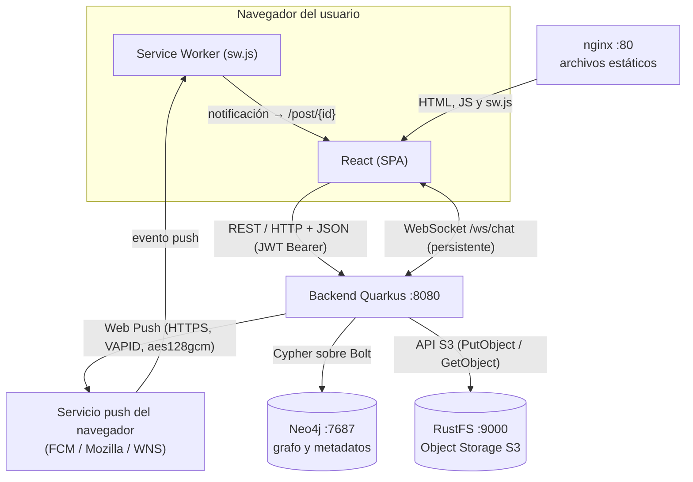

# Red Social Distribuida

Aplicación web distribuida que implementa las funcionalidades esenciales de una red social. El objetivo es **diseñar, implementar y justificar una arquitectura distribuida**: cada componente tiene una responsabilidad clara y se comunica mediante el mecanismo adecuado (REST, WebSocket, Web Push, Cypher, API S3).

Proyecto de la asignatura Sistemas Distribuidos.

---

## Índice

1. [Integrantes](#1-integrantes)
2. [Estado del proyecto](#2-estado-del-proyecto)
3. [Arquitectura](#3-arquitectura)
4. [Tecnologías](#4-tecnologías)
5. [Requisitos previos](#5-requisitos-previos)
6. [Puesta en marcha con Docker](#6-puesta-en-marcha-con-docker) ⭐ Recomendado
7. [Puesta en marcha (modo dev local)](#7-puesta-en-marcha-modo-dev-local)
8. [Uso diario](#8-uso-diario)
9. [Variables de entorno](#9-variables-de-entorno)
10. [Puertos usados](#10-puertos-usados)
11. [Estructura del repositorio](#11-estructura-del-repositorio)
12. [API REST (endpoints actuales)](#12-api-rest-endpoints-actuales)
13. [Modelo del grafo](#13-modelo-del-grafo)
14. [Consultas Cypher](#14-consultas-cypher)
15. [Uso de REST](#15-uso-de-rest)
16. [Uso de WebSocket (chat en tiempo real)](#16-uso-de-websocket-chat-en-tiempo-real)
17. [Uso de Web Push](#17-uso-de-web-push-notificaciones-fuera-de-la-aplicación)
18. [Dónde se guarda cada tipo de información](#18-dónde-se-guarda-cada-tipo-de-información)
19. [Flujo de trabajo en Git](#19-flujo-de-trabajo-en-git)
20. [Solución de problemas](#20-solución-de-problemas)
21. [Decisiones técnicas](#21-decisiones-técnicas)

---

## 1. Integrantes

| Integrante | Área principal |
|---|---|
| Peter Orrala | A. Usuarios y grafo social |
| Skay Alvarado | B. Contenido, S3, feed y reacciones |
| Amy Tomala Silvestre | C. Chat en tiempo real (WebSocket) |
| Ismael Anchundia | D. Infraestructura, Web Push, diagrama y documentación |

---

## 2. Estado del proyecto

- [x] Infraestructura: Neo4j y almacenamiento S3 con Docker Compose
- [x] Backend base con Quarkus
- [x] Registro e inicio de sesión (bcrypt + JWT)
- [x] Perfiles de usuario (consultar y editar)
- [x] Grafo social: seguir, seguidores, seguidos y sugerencias
- [x] Publicaciones con imagen en S3
- [x] Feed personalizado y reacciones
- [x] Chat en tiempo real (WebSocket)
- [x] Notificaciones Web Push
- [x] Frontend React
- [x] Dockerización completa (backend y frontend en contenedores)

---

## 3. Arquitectura

El diagrama representa la arquitectura realmente implementada (también en [docs/arquitectura.md](docs/arquitectura.md) y como imagen en [docs/arquitectura.png](docs/arquitectura.png)).



| Origen → Destino | Mecanismo | Para qué |
|---|---|---|
| React → Quarkus | REST / HTTP + JSON, JWT en `Authorization` | CRUD y consultas |
| React ↔ Quarkus | WebSocket `/ws/chat` (persistente, bidireccional) | Mensajes del chat en tiempo real |
| Quarkus → Neo4j | Cypher sobre Bolt | Usuarios, relaciones, posts, mensajes, suscripciones |
| Quarkus → RustFS | API S3 | Guardar y leer las imágenes |
| Quarkus → Servicio push | Web Push (HTTPS + VAPID) | Avisar a los seguidores cuando alguien publica |
| Servicio push → Service Worker | Evento `push` del navegador | Mostrar la notificación con la app cerrada |

El navegador nunca se conecta directamente a Neo4j ni a RustFS: las imágenes se piden al backend (`GET /media/{clave}`). Web Push no sale de Neo4j: lo envía el backend al servicio push del fabricante del navegador, y este lo entrega al Service Worker.

| Necesidad | Mecanismo | Componente |
|---|---|---|
| Operaciones CRUD y consultas | REST / HTTP + JSON | Quarkus |
| Relaciones sociales | Base de datos de grafos (Cypher) | Neo4j |
| Archivos de las publicaciones | Object Storage (API S3) | RustFS |
| Mensajería bidireccional | WebSocket | Quarkus |
| Notificaciones fuera de la app | Web Push | Quarkus + Service Worker |
| Despliegue reproducible | Contenedores | Docker Compose |

---

## 4. Tecnologías

| Componente | Tecnología |
|---|---|
| Frontend | React (Vite) |
| Backend | Quarkus 3.39 + Java 21 + Maven |
| Base de datos de grafos | Neo4j 5 Community |
| Almacenamiento de archivos | RustFS (compatible con S3) |
| Autenticación | JWT (RSA) + bcrypt |
| Tiempo real | WebSocket (`quarkus-websockets-next`) |
| Notificaciones | Web Push (VAPID) |
| Contenedores | Docker / Docker Compose |

---

## 5. Requisitos previos

**Opción A - Docker (Recomendado):**
- Solo necesitas Docker Desktop (o Docker Engine con Compose v2.20 o superior) y unos 4 GB de RAM libres
- Conexión a internet la primera vez (descarga imágenes y dependencias; puede tardar 10-15 minutos)
- Puertos libres: 80, 8080, 7474, 7687, 9000 y 9001. Si el 80 está ocupado (IIS, XAMPP, Skype), detén ese programa
- Funciona en Windows, Linux y macOS. Ver guía completa en [README-DOCKER.md](README-DOCKER.md)

**Opción B - Modo dev local:**
- Git for Windows
- Docker Desktop
- JDK 21 (Temurin)
- Node.js 20+

---

## 6. Puesta en marcha con Docker 

Esta es la forma más rápida de probar el proyecto sin instalar dependencias.

1. **Clonar el repositorio:**
   ```powershell
   git clone https://github.com/Peter-LOV/red-social-distribuida.git
   cd red-social-distribuida
   ```
2. **Configurar credenciales:**
   ```powershell
   Copy-Item .env.example .env
   notepad .env
   ```
   Cambia `NEO4J_PASSWORD`, `S3_ACCESS_KEY` y `S3_SECRET_KEY`. Las llaves VAPID son opcionales: si se dejan vacías, el backend genera un par en el primer arranque y lo conserva en el volumen `vapid_keys`.

3. **Levantar todo:**
   ```powershell
   docker compose up -d --build
   ```

   El archivo `.env.example` funciona tal cual para una prueba local: basta con copiarlo.

4. **Cargar datos de demostración (opcional):** 8 usuarios con clave `demo1234`, una red de seguimiento y 5 publicaciones.
   ```powershell
   docker compose --profile seed run --rm seed
   ```
   Funciona en cualquier sistema operativo y se puede repetir sin duplicar datos. Usuarios: `ana@demo.com`, `beto@demo.com`, `carla@demo.com`, `diego@demo.com`, `elena@demo.com`, `fabian@demo.com`, `gabriela@demo.com`, `hugo@demo.com`.

5. **Acceder:**
   - Frontend: http://localhost (usar `localhost` y no la IP: Web Push solo funciona en `localhost` o HTTPS)
   - Swagger: http://localhost:8080/q/swagger-ui
   - Neo4j Browser: http://localhost:7474 (usuario `neo4j`, contraseña `NEO4J_PASSWORD` del `.env`)
   - Consola de RustFS: http://localhost:9001 (`S3_ACCESS_KEY` / `S3_SECRET_KEY` del `.env`)

La aplicación está pensada para usarse desde el mismo equipo (`http://localhost`). Desde otro equipo de la red no funciona sin cambiar `VITE_API_URL` y los orígenes CORS del backend, y Web Push exige `localhost` o HTTPS.

Para instrucciones detalladas, ver [README-DOCKER.md](README-DOCKER.md).

---

## 7. Puesta en marcha (modo dev local)

Si eres desarrollador y quieres recarga en caliente (hot reload):

### Paso 1: Clonar y configurar

```powershell
git clone https://github.com/Peter-LOV/red-social-distribuida.git
cd red-social-distribuida
Copy-Item .env.example .env
notepad .env
```

Cambia las credenciales en `.env` y cópialo a `backend/.env`.

### Paso 2: Verificar Java 21

```powershell
java -version
```

Si no dice `21.x`, ajusta `JAVA_HOME`:
```powershell
$env:JAVA_HOME = "C:\Program Files\Eclipse Adoptium\jdk-21.0.12.1-hotspot"
$env:Path = "$env:JAVA_HOME\bin;$env:Path"
```

### Paso 3: Levantar infraestructura

Solo Neo4j y RustFS; el backend y el frontend se arrancan a mano en los pasos 5 y 6 (si se levanta todo, el contenedor del backend ocupa el puerto 8080).

```powershell
docker compose up -d neo4j rustfs
```

### Paso 4: Generar llaves JWT

```powershell
powershell -ExecutionPolicy Bypass -File .\scripts\generate-jwt-keys.ps1
```

### Paso 5: Arrancar backend

```powershell
cd backend
.\mvnw quarkus:dev
```

### Paso 6: Arrancar frontend (otra terminal)

```powershell
cd frontend
npm run dev
```

---

## 8. Uso diario

### Con Docker:

```powershell
docker compose up -d      # Levantar
docker compose down       # Detener
```

### Modo dev local:

```powershell
docker compose up -d neo4j rustfs # Infraestructura
cd backend && .\mvnw quarkus:dev # Backend
cd frontend && npm run dev          # Frontend
```

---

## 9. Variables de entorno

| Variable | Descripción | Ejemplo / valor por defecto |
|---|---|---|
| `NEO4J_PASSWORD` | Contraseña de Neo4j (mínimo 8 caracteres). **Obligatoria** | `TuClaveNeo4j2026` |
| `NEO4J_USER` | Usuario de Neo4j | `neo4j` |
| `NEO4J_URI` | Dirección Bolt de Neo4j. En Docker la fija el compose | `bolt://localhost:7687` (Docker: `bolt://neo4j:7687`) |
| `S3_ACCESS_KEY` | Usuario S3 (mínimo 8 caracteres). **Obligatoria** | `tuusuarios3` |
| `S3_SECRET_KEY` | Contraseña S3 (mínimo 8 caracteres). **Obligatoria** | `TuClaveSecretaLarga` |
| `S3_ENDPOINT` | Dirección de la API S3. En Docker la fija el compose | `http://localhost:9000` (Docker: `http://rustfs:9000`) |
| `S3_BUCKET` | Bucket de las imágenes; se crea solo al arrancar | `posts-media` |
| `VAPID_PUBLIC_KEY` | Clave pública VAPID. **Opcional**: vacía = el backend genera el par y lo guarda. Para fijarla: `npx web-push generate-vapid-keys` | `BBtMvrOmBrpWspD1iLgb...` |
| `VAPID_PRIVATE_KEY` | Clave privada VAPID. Opcional; si se define, debe ir junto con la pública. **Secreto: no subir a Git** | `KBEzGlWoyNi85Je2419Tw...` |
| `VAPID_KEYS_DIR` | Carpeta donde el backend guarda las llaves VAPID que genera. En Docker la fija el compose | `vapid-keys` (Docker: `/vapid`, volumen `vapid_keys`) |
| `VAPID_SUBJECT` | Contacto del servidor para el servicio push | `mailto:admin@redsocial.local` |
| `JWT_PUBLIC_KEY_PATH` | Ruta de la llave pública RSA (solo modo dev; en Docker la genera el servicio `jwt-keys`) | `/publicKey.pem` |
| `JWT_PRIVATE_KEY_PATH` | Ruta de la llave privada RSA (solo modo dev) | `/privateKey.pem` |
| `VITE_API_URL` | URL del backend que usa el frontend. En Docker se pasa como *build arg* desde el compose; en dev, en `frontend/.env` | `http://localhost:8080` |

Todas se definen en el archivo `.env` de la raíz (plantilla en `.env.example`). `docker-compose.yml` las entrega a cada contenedor.

---

## 10. Puertos usados

| Puerto | Servicio |
|---|---|
| 80 | Frontend (Docker) |
| 8080 | Backend / Swagger |
| 7474 | Neo4j Browser |
| 7687 | Neo4j Bolt |
| 9000 | API S3 (RustFS) |
| 9001 | Consola RustFS |
| 5173 | Frontend (modo dev) |

---

## 11. Estructura del repositorio

```text
red-social-distribuida/
├── backend/                     Quarkus (Java 21, Maven)
│   └── src/main/java/com/redsocial/
│       ├── common/              Código compartido
│       ├── usuarios/            Registro, login, perfiles, grafo
│       ├── posts/               Publicaciones, S3, feed
│       ├── chat/                WebSocket
│       └── push/                Web Push
├── frontend/                    React (Vite)
├── scripts/                     Scripts de ayuda
├── docs/                        Documentación
├── docker-compose.yml           Todos los servicios
├── README.md                    Este archivo
└── README-DOCKER.md            Guía específica de Docker
```

---

## 12. API REST (endpoints actuales)

Documentación interactiva: http://localhost:8080/q/swagger-ui

| Método | Ruta | Auth | Descripción |
|---|---|---|---|
| `POST` | `/auth/registro` | No | Registrar usuario (devuelve token y usuario) |
| `POST` | `/auth/login` | No | Iniciar sesión (devuelve token y usuario) |
| `GET` | `/usuarios/me` | Sí | Mi perfil |
| `PUT` | `/usuarios/me` | Sí | Editar nombre y biografía |
| `GET` | `/usuarios/{id}` | Sí | Perfil de un usuario (el email solo se incluye en el perfil propio) |
| `GET` | `/usuarios?buscar=texto` | Sí | Buscar usuarios por nombre (mínimo 2 caracteres, máximo 20 resultados) |
| `POST` | `/social/seguir/{id}` | Sí | Seguir usuario |
| `DELETE` | `/social/seguir/{id}` | Sí | Dejar de seguir |
| `GET` | `/social/seguidores/{id}` | Sí | Seguidores de un usuario |
| `GET` | `/social/seguidos/{id}` | Sí | Usuarios seguidos por un usuario |
| `GET` | `/social/estado/{id}` | Sí | Si lo sigo, si me sigue y sus contadores |
| `GET` | `/social/sugerencias` | Sí | Sugerencias basadas en el grafo |
| `GET` | `/social/en-comun/{id}` | Sí | Usuarios que sigo yo y también sigue `{id}` |
| `GET` | `/social/alcanzables` | Sí | Usuarios alcanzables hasta en 3 saltos |
| `GET` | `/social/grafo` | Sí | Nodos y enlaces para dibujar el grafo |
| `POST` | `/posts` | Sí | Crear publicación (`multipart/form-data`: `texto` e `imagen` opcional) |
| `GET` | `/posts/{id}` | Sí | Detalle de publicación |
| `GET` | `/posts?autor={id}&pagina=0` | Sí | Publicaciones de un usuario (pestaña "Publicaciones" del perfil) |
| `GET` | `/feed?pagina=0` | Sí | Feed personalizado (20 por página) |
| `POST` | `/posts/{id}/reaccion` | Sí | Reaccionar (`{"tipo": "LIKE" \| "LOVE" \| "HAHA" \| "WOW"}`) |
| `DELETE` | `/posts/{id}/reaccion` | Sí | Quitar reacción |
| `GET` | `/media/{clave}` | No | Sirve la imagen guardada en S3 (`503` si el almacenamiento no responde) |
| `POST` | `/chat/conversaciones` | Sí | Iniciar conversación (`{"usuarioId": "..."}`) |
| `GET` | `/chat/conversaciones` | Sí | Mis conversaciones |
| `GET` | `/chat/conversaciones/{id}/mensajes` | Sí | Historial de la conversación |
| `WS` | `/ws/chat?token=<JWT>` | Sí (token en la URL) | Chat en tiempo real (ver [sección 16](#16-uso-de-websocket-chat-en-tiempo-real)) |
| `GET` | `/push/clave-publica` | No | Clave pública VAPID |
| `POST` | `/push/suscripcion` | Sí | Registrar suscripción push |
| `DELETE` | `/push/suscripcion?endpoint=...` | Sí | Cancelar suscripción push |
| `GET` | `/q/health` | No | Estado del backend |

Códigos de respuesta: `200`/`201`/`204` en éxito, `400` datos inválidos, `401` sin token o token inválido, `404` recurso inexistente, `409` email ya registrado y `503` si Neo4j o el almacenamiento no responden. Los errores devuelven `{"error": "mensaje"}`.

Los endpoints se agrupan por recurso (`/auth`, `/usuarios`, `/social`, `/posts`, `/feed`, `/chat`, `/push`). Detalle de cómo se usa REST en la [sección 15](#15-uso-de-rest).

---

## 13. Modelo del grafo

```text
(:Usuario {id, nombre, email, passwordHash, bio, creadoEn})
(:Post {id, texto, fecha, mediaKey})
(:Conversacion {id, creadaEn})
(:Mensaje {id, texto, fecha})
(:Suscripcion {endpoint, p256dh, auth})

(:Usuario)-[:SIGUE {desde}]->(:Usuario)
(:Usuario)-[:PUBLICA]->(:Post)
(:Usuario)-[:REACCIONA {tipo, fecha}]->(:Post)
(:Usuario)-[:PARTICIPA_EN]->(:Conversacion)
(:Conversacion)-[:CONTIENE]->(:Mensaje)
(:Usuario)-[:ENVIO]->(:Mensaje)
(:Usuario)-[:TIENE_SUSCRIPCION]->(:Suscripcion)
```

| Relación | Propiedades | Para qué sirve |
|---|---|---|
| `SIGUE` | `desde` (fecha) | Grafo social: seguidores, seguidos, sugerencias, feed, destinatarios de Web Push |
| `PUBLICA` | — | Une a cada autor con sus publicaciones; con `SIGUE` forma el feed |
| `REACCIONA` | `tipo` (`LIKE`, `LOVE`, `HAHA`, `WOW`), `fecha` | Reacciones; una por usuario y publicación |
| `PARTICIPA_EN` | — | Los dos usuarios de una conversación |
| `CONTIENE` / `ENVIO` | — | Mensajes de una conversación y su autor |
| `TIENE_SUSCRIPCION` | — | Dispositivos del usuario registrados para Web Push |

**Restricciones e índices** (se crean solos al arrancar el backend):

- `Usuario.id` y `Usuario.email` únicos.
- `Post.id` único e índice sobre `Post.fecha`.
- `Conversacion.id` y `Mensaje.id` únicos e índice sobre `Mensaje.fecha`.
- `Suscripcion.endpoint` único.

**Separación de datos:** `Post.mediaKey` solo guarda la clave del objeto en S3; la imagen nunca se almacena en Neo4j (ver [sección 18](#18-dónde-se-guarda-cada-tipo-de-información)).

---

## 14. Consultas Cypher

Todo el Cypher vive en los repositorios del backend (`GrafoRepository`, `PostRepository`, `ChatRepository`, `PushRepository`, `UsuarioRepository`) y usa siempre **parámetros** (`$id`, `$yo`...), nunca concatenación de texto, para evitar inyección Cypher.

| # | Consulta | Método | Niveles | Resuelve |
|---|---|---|---|---|
| 1 | Seguir (MERGE) | `GrafoRepository.seguir` | 1 | Crear `SIGUE` sin duplicarla |
| 2 | Seguidores | `GrafoRepository.seguidores` | 1 | Quién sigue a un usuario |
| 3 | Seguidos | `GrafoRepository.seguidos` | 1 | A quién sigue un usuario |
| 4 | Usuarios en común | `GrafoRepository.enComun` | 2 (patrón en V) | A quién seguimos ambos |
| 5 | **Sugerencias** ⭐ | `GrafoRepository.sugerencias` | 2 | Usuarios recomendados |
| 6 | **Alcanzables** ⭐ | `GrafoRepository.alcanzables` | 1 a 3 (longitud variable) | Usuarios alcanzables por la red |
| 7 | **Feed** ⭐ | `PostRepository.feed` | 2 (`SIGUE` → `PUBLICA`) | Publicaciones de la red del usuario |
| 8 | Estado de relación | `GrafoRepository.estado` | 1 | Botón Seguir y contadores del perfil |
| 9 | Grafo completo | `GrafoRepository.grafo` | 1 | Visualización del grafo |
| 10 | Reaccionar (MERGE) | `PostRepository.reaccionar` | 1 | Crear o cambiar `REACCIONA` |
| 11 | Destinatarios de Web Push | `PushRepository.destinatarios` | 2 (`SIGUE` → `TIENE_SUSCRIPCION`) | A quién notificar |
| 12 | Obtener o crear conversación | `ChatRepository.obtenerOCrearConversacion` | 2 | Una sola conversación por pareja |
| 13 | Historial de conversación | `ChatRepository.obtenerHistorial` | 3 | Mensajes ordenados de una conversación |

Las marcadas con ⭐ son las que recorren relaciones de **más de un nivel** y responden a los problemas pedidos: recomendados, alcanzables y publicaciones de la red de un usuario.

### 1. Seguir (MERGE)

```cypher
MATCH (a:Usuario {id: $yo}), (b:Usuario {id: $otro})
WHERE a <> b
MERGE (a)-[r:SIGUE]->(b)
ON CREATE SET r.desde = datetime()
RETURN count(r) AS n
```

`MERGE` hace la operación idempotente: seguir dos veces no duplica la relación. Dejar de seguir es `MATCH (:Usuario {id:$yo})-[r:SIGUE]->(:Usuario {id:$otro}) DELETE r`.

### 2. Seguidores y 3. Seguidos

```cypher
// Seguidores de $id
MATCH (u:Usuario)-[:SIGUE]->(:Usuario {id: $id})
RETURN u.id AS id, u.nombre AS nombre, u.bio AS bio
ORDER BY u.nombre

// Seguidos por $id
MATCH (:Usuario {id: $id})-[:SIGUE]->(u:Usuario)
RETURN u.id AS id, u.nombre AS nombre, u.bio AS bio
ORDER BY u.nombre
```

### 4. Usuarios en común (patrón en V)

```cypher
MATCH (a:Usuario {id: $yo})-[:SIGUE]->(comun:Usuario)<-[:SIGUE]-(b:Usuario {id: $otro})
RETURN comun.id AS id, comun.nombre AS nombre, comun.bio AS bio
ORDER BY comun.nombre
```

Se muestra en el perfil de otro usuario: "a quién seguimos los dos".

### 5. Sugerencias: amigos de amigos ⭐

```cypher
MATCH (yo:Usuario {id: $id})-[:SIGUE]->(amigo:Usuario)-[:SIGUE]->(c:Usuario)
WHERE c <> yo AND NOT (yo)-[:SIGUE]->(c)
WITH c, collect(DISTINCT amigo.nombre) AS mediadores
RETURN c.id AS id, c.nombre AS nombre,
       size(mediadores) AS enComun,
       mediadores[0..3] AS via,
       COUNT { (c)<-[:SIGUE]-() } AS popularidad
ORDER BY enComun DESC, popularidad DESC, nombre
LIMIT 10
```

**Criterio de recomendación (diseñado por el grupo):**

1. *Candidatos:* usuarios a 2 saltos (`yo → amigo → C`) que yo todavía no sigo y que no soy yo.
2. *Ranking principal (`enComun`):* a cuántos de **mis seguidos** sigue ya el candidato. Más conexiones a través de gente que yo elegí seguir significa más probabilidad de afinidad.
3. *Desempate (`popularidad`):* número total de seguidores del candidato, y luego el nombre para un orden estable.
4. *Explicabilidad (`via`):* hasta 3 nombres de los mediadores, para que la interfaz diga "Lo siguen Ana y Beto".
5. *Límite:* 10 sugerencias.

**Arranque en frío:** un usuario que no sigue a nadie no tiene candidatos a 2 saltos. Solo en ese caso (cuando la consulta anterior no devuelve nada) se usa una segunda consulta que sugiere a los usuarios con más seguidores a los que todavía no sigue. Sigue siendo información del grafo (grado de entrada de `SIGUE`), nunca un orden aleatorio:

```cypher
MATCH (yo:Usuario {id: $id}), (c:Usuario)
WHERE c <> yo AND NOT (yo)-[:SIGUE]->(c)
RETURN c.id AS id, c.nombre AS nombre,
       COUNT { (c)<-[:SIGUE]-() } AS popularidad
ORDER BY popularidad DESC, nombre
LIMIT 10
```

### 6. Usuarios alcanzables hasta 3 saltos ⭐

```cypher
MATCH p = (yo:Usuario {id: $id})-[:SIGUE*1..3]->(u:Usuario)
WHERE u <> yo
WITH u, min(length(p)) AS saltos
RETURN u.id AS id, u.nombre AS nombre, saltos
ORDER BY saltos, nombre
LIMIT 50
```

Recorrido de **longitud variable**. Si un usuario es alcanzable por varios caminos, se queda con el más corto (`min(length(p))`). Cypher no permite parametrizar el rango `*1..3`, por eso el 3 va fijo en la consulta.

### 7. Feed personalizado ⭐

```cypher
MATCH (:Usuario {id: $yo})-[:SIGUE]->(autor:Usuario)-[:PUBLICA]->(p:Post)
OPTIONAL MATCH (:Usuario)-[r:REACCIONA]->(p)
WITH p, autor, count(r) AS reacciones
OPTIONAL MATCH (:Usuario {id: $yo})-[mia:REACCIONA]->(p)
RETURN p.id AS id, p.texto AS texto, p.mediaKey AS mediaKey,
       toString(p.fecha) AS fecha, autor.id AS autorId, autor.nombre AS autorNombre,
       reacciones, mia IS NOT NULL AS yaReaccione
ORDER BY p.fecha DESC, p.id
SKIP $saltar LIMIT $limite
```

El feed **sale del grafo**: primero se recorre `SIGUE` y luego `PUBLICA`, así que solo aparecen publicaciones de las personas que sigo (no las "últimas de todos"). Incluye el total de reacciones y si ya reaccioné yo. Se pagina de 20 en 20 con el parámetro `pagina`. El feed no incluye las publicaciones propias.

### 8. Estado de relación entre dos usuarios

```cypher
MATCH (u:Usuario {id: $otro})
RETURN EXISTS { (:Usuario {id: $yo})-[:SIGUE]->(u) } AS sigo,
       EXISTS { (u)-[:SIGUE]->(:Usuario {id: $yo}) } AS meSigue,
       COUNT { (u)<-[:SIGUE]-() } AS seguidores,
       COUNT { (u)-[:SIGUE]->() } AS seguidos
```

### 9. Grafo completo (visualización)

```cypher
MATCH (u:Usuario)
OPTIONAL MATCH (u)-[:SIGUE]->(v:Usuario)
RETURN u.id AS id, u.nombre AS nombre, collect(v.id) AS sigue
```

El backend lo transforma a `{ nodos: [{id, nombre}], enlaces: [{source, target}] }` y el frontend lo dibuja con `react-force-graph-2d`.

### 10. Reaccionar

```cypher
MATCH (u:Usuario {id: $yo}), (p:Post {id: $post})
MERGE (u)-[r:REACCIONA]->(p)
ON CREATE SET r.tipo = $tipo, r.fecha = datetime()
ON MATCH SET r.tipo = $tipo
RETURN COUNT { (:Usuario)-[:REACCIONA]->(p) } AS total
```

Un usuario tiene como máximo una reacción por publicación; si vuelve a reaccionar, cambia el `tipo`.

### 11. Destinatarios de Web Push

```cypher
MATCH (seguidor:Usuario)-[:SIGUE]->(:Usuario {id: $autorId})
MATCH (seguidor)-[:TIENE_SUSCRIPCION]->(s:Suscripcion)
RETURN s.endpoint AS endpoint, s.p256dh AS p256dh, s.auth AS auth
```

Cuando alguien publica, se notifica a sus seguidores que tienen al menos una suscripción push registrada.

### 12. Obtener o crear la conversación entre dos usuarios

```cypher
MATCH (a:Usuario {id: $yo}), (b:Usuario {id: $otro})
WHERE a <> b
MERGE (a)-[:PARTICIPA_EN]->(c:Conversacion)<-[:PARTICIPA_EN]-(b)
ON CREATE SET c.id = $nuevoId, c.creadaEn = datetime()
RETURN c.id AS id
```

El patrón del `MERGE` busca una conversación que ya una a los dos; si no existe, la crea. Así hay una única conversación por pareja.

### 13. Historial de una conversación

```cypher
MATCH (:Usuario {id: $yo})-[:PARTICIPA_EN]->(c:Conversacion {id: $conv})
      -[:CONTIENE]->(m:Mensaje)<-[:ENVIO]-(autor:Usuario)
RETURN m.id AS id, m.texto AS texto, toString(m.fecha) AS fecha, autor.id AS autorId
ORDER BY m.fecha ASC
```

El patrón parte del usuario que consulta, por lo que solo ve el historial de conversaciones en las que participa.

### 14. Búsqueda de usuarios y 15. Publicaciones de un autor

```cypher
// Búsqueda por nombre; indica además si ya lo sigo
MATCH (u:Usuario)
WHERE u.id <> $yo AND toLower(u.nombre) CONTAINS toLower($texto)
RETURN u.id AS id, u.nombre AS nombre, u.bio AS bio,
       EXISTS { (:Usuario {id: $yo})-[:SIGUE]->(u) } AS sigo
ORDER BY u.nombre, u.id
LIMIT 20
```

Las publicaciones de un autor (`PostRepository.deAutor`) usan la misma consulta del feed, partiendo de `(autor:Usuario {id: $autor})-[:PUBLICA]->(p:Post)`.

### Cómo probarlas en Neo4j Browser

1. Abrir http://localhost:7474 (usuario `neo4j`, contraseña `NEO4J_PASSWORD` del `.env`).
2. Cargar datos de demostración con `docker compose --profile seed run --rm seed` (ver [Guía de datos de prueba](#guía-de-datos-de-prueba)).
3. Definir un parámetro y ejecutar cualquier consulta: `:param id => 'pegar-aqui-el-id-de-ana'`.
4. Para ver todo el grafo social: `MATCH (a:Usuario)-[r:SIGUE]->(b:Usuario) RETURN a, r, b`.

#### Guía de datos de prueba

Cualquier sistema operativo, con Docker:

```bash
docker compose --profile seed run --rm seed
```

Alternativas equivalentes: `sh scripts/seed.sh` (Linux, macOS o Git Bash; necesita `curl`) o, en Windows, `scripts\seed.ps1` y `scripts\seed-posts.ps1` con PowerShell.

Crea 8 usuarios (clave `demo1234`), una red de seguimiento y 5 publicaciones. Usa la API REST del backend (no inserta datos directamente en Neo4j), así que el backend debe estar en ejecución. Se puede ejecutar varias veces sin duplicar datos.

---

## 15. Uso de REST

**Qué es:** comunicación *petición → respuesta* sobre HTTP. El cliente pregunta, el servidor responde y la interacción termina; el servidor no guarda estado de la conversación entre peticiones.

**Qué problema resuelve aquí:** todas las operaciones convencionales de la red social, es decir, las que el usuario solicita de forma puntual y cuya respuesta no necesita ser empujada por el servidor.

| Grupo | Rutas | Qué se resuelve |
|---|---|---|
| Autenticación | `/auth/*` | Registro e inicio de sesión; devuelve un JWT |
| Perfiles | `/usuarios/*` | Consultar y editar perfiles |
| Grafo social | `/social/*` | Seguir, dejar de seguir, seguidores, seguidos, sugerencias, en común, alcanzables, grafo |
| Contenido | `/posts/*`, `/feed`, `/media/*` | Publicar (con imagen), feed, reacciones, servir imágenes |
| Chat (historial) | `/chat/*` | Crear conversación, listar conversaciones, leer historial |
| Notificaciones | `/push/*` | Entregar la clave pública VAPID y registrar suscripciones |

**Cómo está implementado:**

- API en Quarkus con RESTEasy Reactive (`quarkus-rest` + `quarkus-rest-jackson`); cuerpos en JSON, salvo `POST /posts`, que es `multipart/form-data` porque lleva texto e imagen.
- **Autenticación:** el cliente envía `Authorization: Bearer <JWT>`. El token se firma con RSA, caduca a las 8 horas y su `subject` es el id del usuario. Los recursos privados llevan `@Authenticated`; son públicos solo `/auth/*`, `/push/clave-publica` y `/media/*` (una etiqueta `` no puede enviar el token; las claves son UUID y se valida su formato).
- Validación de entrada con Hibernate Validator y errores como `{"error": "..."}` con el código HTTP correspondiente (400, 401, 404, 409, 503).
- **Autorización:** el usuario que actúa sale siempre del token, nunca de un id enviado por el cliente. Por eso nadie puede publicar, seguir, reaccionar o editar el perfil en nombre de otro.
- **Subida de imágenes:** el tipo se decide por el contenido real del archivo (sus primeros bytes), no por el `Content-Type` que declara el cliente; solo se aceptan JPG, PNG, WEBP y GIF de hasta 10 MB.
- Documentación interactiva con OpenAPI/Swagger.

**Por qué REST y no otra cosa:** es sin estado, fácil de paginar (`/feed?pagina=N`) y de cachear (las imágenes llevan `Cache-Control`), y no exige mantener una conexión abierta por cada operación puntual.

---

## 16. Uso de WebSocket (chat en tiempo real)

### REST frente a WebSocket

```text
REST                                   WebSocket
Cliente ── petición ──▶ Servidor       Cliente ◀════════════▶ Servidor
Cliente ◀── respuesta ── Servidor      una conexión persistente; cualquiera
(una conexión por petición;            de los dos lados envía cuando quiere
 el servidor nunca habla primero)
```

| | REST / HTTP | WebSocket |
|---|---|---|
| Modelo | Petición → respuesta | Conexión persistente y bidireccional |
| Quién inicia el intercambio | Siempre el cliente | Cliente **o servidor** |
| Estado | Sin estado | Conexión abierta con estado |
| Para recibir novedades | El cliente tiene que preguntar (polling) | El servidor las empuja al instante |
| Uso en este proyecto | CRUD, grafo, feed, historial | Entrega de mensajes del chat en tiempo real |

**Por qué no hacer polling con REST:** para enterarse de un mensaje nuevo, el cliente tendría que repetir peticiones cada pocos segundos. Eso genera tráfico inútil, añade latencia y no escala. Con WebSocket el servidor envía el mensaje en el momento en que llega.

### Cómo está implementado

- **Endpoint:** `ws://<host>:8080/ws/chat?token=<JWT>`, clase `ChatSocket` (`quarkus-websockets-next`).
- **Autenticación:** el navegador no permite cabeceras personalizadas al abrir un WebSocket, así que el JWT va en la URL. Al abrir la conexión, el servidor valida firma y caducidad con `JWTParser`; si el token falta o es inválido, cierra la conexión.
- **Registro de conexiones:** un mapa en memoria `usuarioId → conexiones abiertas`, que admite varias pestañas por usuario.
- **Mensaje del cliente al servidor:**

  ```json
  { "conversacionId": "…", "texto": "hola" }
  ```

- **Mensaje del servidor al cliente:**

  ```json
  { "tipo": "mensaje", "id": "…", "conversacionId": "…", "autorId": "…", "texto": "hola", "fecha": "…" }
  ```

- **Mensaje de error del servidor** (conversación ajena, formato inválido o texto de más de 2000 caracteres); la conexión no se cierra:

  ```json
  { "tipo": "error", "error": "No participas en esta conversación" }
  ```

- **Flujo al enviar un mensaje:**
  1. El servidor identifica al emisor por su conexión.
  2. Guarda el mensaje en Neo4j: `(:Conversacion)-[:CONTIENE]->(:Mensaje)` y `(:Usuario)-[:ENVIO]->(:Mensaje)`.
  3. Entrega el mensaje a todas las conexiones del destinatario **y** a las demás pestañas del emisor.
- **Inicio de conversación, lista de conversaciones e historial:** por REST (`/chat/*`), porque son consultas puntuales. El historial se lee de Neo4j, no depende de la conexión.
- **Reconexión:** si la conexión se cae, el cliente reintenta con esperas crecientes (de 1,5 s hasta 15 s). Los mensajes escritos durante el corte quedan en cola y se envían al reconectar. Al salir de la pantalla del chat la conexión se cierra y no se vuelve a abrir.
- **Sin polling:** no hay `setInterval` ni peticiones REST repetidas; los mensajes llegan porque el servidor los envía por la conexión abierta.

### Cómo comprobar el tiempo real

Abrir dos navegadores distintos con dos usuarios distintos, iniciar una conversación desde uno y escribir: el mensaje aparece en el otro sin recargar la página.

---

## 17. Uso de Web Push (notificaciones fuera de la aplicación)

**Qué problema resuelve:** avisar al usuario de una publicación nueva **aunque la aplicación esté cerrada**. Un WebSocket no sirve para esto, porque solo existe mientras la página está abierta, y una alerta dibujada con React tampoco.

### Flujo completo

```text
Anthony sigue a Carlos

 1. Anthony pulsa "activar notificaciones"
      navegador ──▶ Service Worker (sw.js) + PushManager.subscribe(clave pública VAPID)
      navegador ──▶ POST /push/suscripcion ──▶ Neo4j: (Anthony)-[:TIENE_SUSCRIPCION]->(:Suscripcion)

 2. Carlos publica (POST /posts)
      backend ──▶ evento NuevoPostEvent (CDI, asíncrono; la publicación no espera al envío)
      WebPushService ──▶ consulta en Neo4j los seguidores de Carlos con suscripción
      WebPushService ──▶ envía el mensaje cifrado, firmado con VAPID, al servicio push del navegador (FCM, Mozilla…)

 3. El servicio push entrega el mensaje al navegador de Anthony, incluso con la pestaña cerrada
      Service Worker (evento "push") ──▶ muestra la notificación del sistema
      Anthony hace clic ──▶ evento "notificationclick" ──▶ abre /post/{id} en la aplicación
```

### Piezas

| Pieza | Dónde | Función |
|---|---|---|
| Claves VAPID | `ClavesVapid`: variables `VAPID_PUBLIC_KEY` / `VAPID_PRIVATE_KEY` o, si están vacías, un par generado y guardado en el volumen `vapid_keys` | Identifican al servidor ante el servicio push |
| `GET /push/clave-publica` | `PushResource` | Entrega al navegador la clave pública para suscribirse |
| `POST/DELETE /push/suscripcion` | `PushResource`, `PushRepository` | Guarda o elimina la suscripción en Neo4j |
| `NuevoPostEvent` | `PostResource` → `WebPushService` | Desacopla la publicación del envío de notificaciones |
| `WebPushService` | backend (librería `nl.martijndwars:web-push`) | Calcula destinatarios, cifra (aes128gcm, RFC 8291) y envía |
| `frontend/public/sw.js` | navegador | Recibe el `push`, muestra la notificación y gestiona el clic |
| `frontend/src/push.js` | frontend | Registra el Service Worker, pide permiso y se suscribe |

**Contenido de la notificación:** `{ "titulo": "<autor> publicó algo nuevo", "cuerpo": "<resumen del texto>", "url": "/post/<id>" }`. La ruta `/post/:id` de React muestra el detalle de la publicación, que es el recurso al que dirige la notificación.

**Suscripciones caducadas:** si el servicio push responde 404 o 410, la suscripción se elimina de Neo4j.

**Suscripción y sesión:** al iniciar sesión, si el navegador ya había concedido el permiso, la suscripción se asocia a la cuenta que entra; al cerrar sesión se elimina. Un usuario solo puede eliminar sus propias suscripciones. Si la llave VAPID del servidor cambia, el frontend lo detecta y vuelve a suscribirse.

**Requisitos del navegador:** HTTPS o `localhost`, soporte de Service Worker y que el usuario conceda el permiso de notificaciones. **No funciona en ventanas de incógnito** ni con la emulación de dispositivo de las herramientas de desarrollo, y el equipo necesita acceso a internet (el envío pasa por el servicio push del fabricante del navegador).

### Cómo probarlo

0. Usar dos navegadores distintos o dos perfiles (ventanas normales, no incógnito): cada navegador tiene su propia suscripción.
1. Con dos usuarios, A sigue a B.
2. A inicia sesión y activa las notificaciones desde la barra de navegación.
3. A cierra la pestaña de la aplicación.
4. B publica algo.
5. A recibe la notificación del sistema; al hacer clic, se abre `/post/<id>`.

Para ver el envío desde el backend: `docker compose logs backend | Select-String "PUSH"` (destinatarios encontrados y código HTTP del servicio push; `201` significa enviado).

---

## 18. Dónde se guarda cada tipo de información

| Información | Dónde vive | Cómo se comunica el backend | Por qué ahí |
|---|---|---|---|
| Usuarios, relaciones `SIGUE`, publicaciones, reacciones | **Neo4j** | Cypher por Bolt | Son datos relacionales de grafo: se recorren relaciones en vez de hacer JOIN |
| Conversaciones y mensajes del chat | **Neo4j** | Cypher por Bolt | Quedan unidos a los usuarios y permiten leer el historial |
| Suscripciones Web Push | **Neo4j** (`:Suscripcion`) | Cypher por Bolt | Se relacionan con el usuario y se buscan a partir de sus seguidores |
| Imágenes de las publicaciones | **Object Storage S3 (RustFS)** | API S3 (AWS SDK) | Los archivos binarios no deben guardarse en la base de datos |
| Referencia a la imagen | `Post.mediaKey` en Neo4j | — | Lo único que Neo4j conserva del archivo |
| Token de sesión (JWT) | Navegador (`localStorage`) | Cabecera `Authorization` | El backend no guarda sesiones, solo verifica la firma |
| Llaves JWT (RSA) | Volumen Docker `jwt_keys` | — | Se generan solas en el primer arranque |
| Claves VAPID | Variables de entorno (`.env`) o volumen Docker `vapid_keys` | — | Son secretos de configuración, no de negocio; si no se definen, se generan solas en el primer arranque |

### Flujo de una publicación con imagen

```text
React ──POST /posts (multipart: texto + imagen)──▶ Quarkus
   Quarkus valida tipo (JPG, PNG, WEBP o GIF) y tamaño (máx. 10 MB)
   Quarkus ──putObject──▶ RustFS (S3), clave: <uuid>.<ext>
   Quarkus ──Cypher──▶ Neo4j: (:Usuario)-[:PUBLICA]->(:Post {mediaKey: "<uuid>.<ext>"})
   Quarkus ──evento──▶ WebPushService
React ──GET /media/<uuid>.<ext>──▶ Quarkus ──getObject──▶ RustFS ──▶ imagen
```

- El bucket `posts-media` se crea automáticamente al arrancar el backend si no existe.
- Si el autor no existe y la publicación no se puede crear, el backend borra la imagen ya subida para no dejar archivos huérfanos.

---

## 19. Flujo de trabajo en Git

```powershell
git checkout main
git pull
git checkout -b feature/mi-funcionalidad
# ... trabajar ...
git add <archivos>
git commit -m "feat(area): descripción"
git push -u origin feature/mi-funcionalidad
```

Luego abrir Pull Request en GitHub.

**Reglas:**
- Nunca hacer push directo a `main`
- Prefijos: `feat`, `fix`, `chore`, `docs`, `refactor`
- Nunca subir `.env`, `.pem` ni llaves VAPID
- Los scripts `.sh` y `mvnw` se guardan con saltos de línea LF (ver `.gitattributes`)

---

## 20. Solución de problemas

| Problema | Solución |
|---|---|
| Docker no funciona | Abre Docker Desktop |
| `docker compose up` falla | Verifica que `.env` existe |
| Error de autenticación Neo4j | `docker compose down -v` y volver a levantar |
| Puerto ocupado | `netstat -ano \| findstr :8080` para identificar |
| Backend no inicia | Verifica que `jwt-keys` terminó con `exited (0)` y revisa `docker compose logs backend` |
| El build falla descargando dependencias | Es la red: vuelve a ejecutar `docker compose up -d --build` (continúa donde se quedó) |
| El puerto 80 está ocupado | Detén el programa que lo usa (IIS, XAMPP…) o cambia `"80:80"` por `"8081:80"` en `docker-compose.yml` y añade `http://localhost:8081` a `quarkus.http.cors.origins` |
| "No se pudieron activar las notificaciones" | No usar incógnito; en el icono a la izquierda de la URL, poner Notificaciones en Permitir y recargar |
| No llega la notificación | Solo se envía cuando publica alguien a quien sigues; revisa `docker compose logs backend \| Select-String "PUSH"` y las notificaciones de Windows para el navegador |

Para más detalles sobre Docker, ver [README-DOCKER.md](README-DOCKER.md).

---

## 21. Decisiones técnicas

Cada decisión responde a qué problema resuelve el componente y por qué se eligió.

| Decisión | Problema que resuelve | Por qué |
|---|---|---|
| **REST para CRUD y consultas** | Operaciones puntuales del usuario | Petición-respuesta sin estado; fácil de paginar y cachear; ideal para React |
| **Neo4j para el modelo social** | Seguir, sugerir y construir el feed | Recorrer relaciones (`SIGUE`, `PUBLICA`) es natural y eficiente; con JOIN encadenados sería costoso y poco legible |
| **Sugerencias por amigos de amigos** | Recomendar sin aleatoriedad | Se usa la estructura del grafo y se explica la recomendación (`via`) |
| **WebSocket para el chat** | Entregar mensajes al instante | El servidor empuja el mensaje por una conexión persistente; el polling con REST estaba prohibido y es ineficiente |
| **Mensajes guardados en Neo4j** | Historial del chat | El historial sobrevive a las desconexiones y se lee por REST |
| **Web Push con VAPID + Service Worker** | Avisar con la aplicación cerrada | Un WebSocket o una alerta de React solo funcionan con la página abierta |
| **Evento CDI asíncrono para notificar** | No retrasar la publicación | Crear el post no espera a que se envíen las notificaciones |
| **Object Storage S3 para imágenes** | Guardar archivos | Neo4j conserva solo la clave; los binarios viven en almacenamiento de objetos |
| **Las imágenes se sirven por el backend (`/media`)** | Mostrar imágenes sin exponer el almacenamiento | S3 no queda abierto al navegador; las claves son UUID y se valida su formato |
| **RustFS en lugar de MinIO** | Servicio compatible con S3 | MinIO fue archivado en 2026; RustFS es compatible con la API S3 |
| **JWT firmado con RSA** | Autenticación sin sesiones en el servidor | Stateless: el token lleva el id del usuario y caduca a las 8 horas |
| **Bcrypt para contraseñas** | Proteger credenciales | Solo se guarda el hash (empieza con `$2a$`) |
| **Docker Compose** | Despliegue reproducible | Un solo comando levanta Neo4j, S3, backend y frontend; las llaves JWT y VAPID se generan solas |

### Pruebas automatizadas

El backend incluye pruebas unitarias de las piezas sin dependencias externas (generación de llaves VAPID y detección del tipo real de una imagen): `cd backend && ./mvnw test`. El resto se verifica con el flujo manual descrito en este README; no hay pruebas de integración automatizadas.

### Comportamiento ante fallos

| Situación | Qué ocurre |
|---|---|
| Neo4j detenido | La API responde `503` con un mensaje claro en unos 5 segundos. Al volver Neo4j, el backend se reconecta solo |
| Backend detenido o reiniciado | El frontend conserva la sesión y muestra "No pudimos conectar con el servidor" con un botón Reintentar. El chat indica "reconectando…" y vuelve a conectarse solo |
| WebSocket cortado | Reintentos con espera creciente; los mensajes escritos durante el corte se envían al reconectar. El historial está en Neo4j |
| Almacenamiento S3 detenido | Publicar con imagen responde `503`; publicar solo texto, el feed y el chat siguen funcionando. Si S3 no responde al arrancar, el backend arranca igual |
| Fallo de Neo4j después de subir una imagen | La imagen se borra de S3 para no dejar archivos huérfanos |

### Limitaciones conocidas

- **Solo `localhost`:** la URL del backend se fija al compilar el frontend y los orígenes CORS son `localhost`/`127.0.0.1`. Para otro dominio hay que cambiar `VITE_API_URL` y `quarkus.http.cors.origins`.
- **Sin HTTPS:** es un despliegue local de demostración. En producción haría falta TLS, y el token del WebSocket dejaría de viajar en claro.
- **Token en `localStorage`:** un XSS podría leerlo. React escapa todo el contenido que se muestra y no se usa `dangerouslySetInnerHTML`.
- **Sin límite de intentos de inicio de sesión** ni revocación de tokens: el token caduca a las 8 horas.
- **Sin borrado ni edición de publicaciones.**
- **Llave VAPID de ejemplo en el historial de Git:** una versión antigua de `application.properties` traía un par VAPID de ejemplo. Se retiró y no se usa; las llaves reales se leen del `.env` o se generan al arrancar.
- **Imágenes de contenedor sin versión fija** (`neo4j:5-community`, `rustfs/rustfs:latest`): una versión futura podría comportarse distinto.
- **Dos usuarios que abren la misma conversación en el mismo instante** podrían crear dos conversaciones; no se ha observado en las pruebas.
- El registro de conexiones WebSocket vive **en la memoria** de una instancia del backend. Con varias instancias haría falta un intermediario de mensajes (por ejemplo Redis o un broker) para repartir mensajes entre ellas.
- El JWT viaja en la URL del WebSocket porque el navegador no permite cabeceras personalizadas al abrir la conexión.
- El feed muestra solo publicaciones de los usuarios seguidos (no las propias).
- `/social/grafo` devuelve el grafo completo a cualquier usuario autenticado, lo cual sirve para la demostración pero no sería adecuado con muchos usuarios.
- El alcance de `/social/alcanzables` está fijado en 3 saltos.
