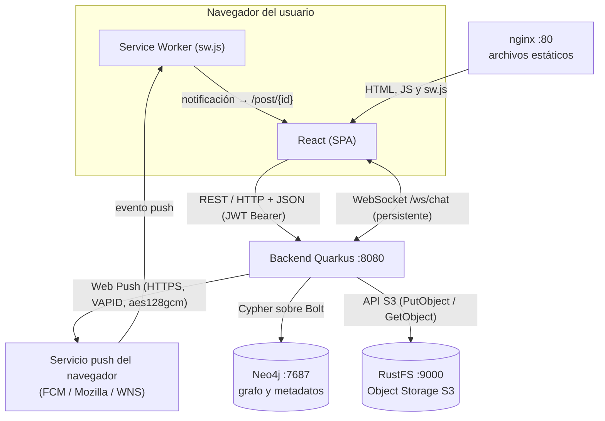

# Diagrama de arquitectura

Este diagrama representa la arquitectura **realmente implementada**. La misma figura está exportada en [arquitectura.png](arquitectura.png).

## Componentes

| Componente | Tecnología | Puerto | Responsabilidad |
|---|---|---|---|
| Frontend | React (Vite), servido por nginx | 80 (Docker) / 5173 (dev) | Interfaz, cliente REST, cliente WebSocket |
| Service Worker | `frontend/public/sw.js` | — | Recibe el evento `push` y muestra la notificación con la app cerrada |
| Backend | Quarkus 3 + Java 21 | 8080 | API REST, servidor WebSocket, envío de Web Push, acceso a datos |
| Base de grafos | Neo4j 5 | 7687 (Bolt), 7474 (Browser) | Usuarios, relaciones, posts, mensajes, suscripciones |
| Object Storage | RustFS (API S3) | 9000 (API), 9001 (consola) | Imágenes de las publicaciones |
| Servicio push | FCM (Chrome), Mozilla (Firefox), WNS (Edge) | — (externo, HTTPS) | Entrega el mensaje push al navegador del destinatario |
| jwt-keys | Contenedor de un solo uso (alpine + openssl) | — | Genera las llaves RSA del JWT en un volumen |

## Conexiones

| # | Origen → Destino | Mecanismo | Contenido |
|---|---|---|---|
| 1 | Navegador → nginx | HTTP | HTML, JS, CSS y `sw.js` |
| 2 | React → Quarkus | REST / HTTP + JSON, `Authorization: Bearer <JWT>` | CRUD y consultas |
| 3 | React ↔ Quarkus | WebSocket `/ws/chat?token=<JWT>` | Mensajes del chat en ambos sentidos |
| 4 | Quarkus → Neo4j | Cypher sobre Bolt | Lecturas y escrituras del grafo |
| 5 | Quarkus → RustFS | API S3 (`PutObject`, `GetObject`, `DeleteObject`) | Binarios de las imágenes |
| 6 | Quarkus → Servicio push | Web Push: HTTPS + VAPID, contenido cifrado (aes128gcm) | Título, resumen y URL del post |
| 7 | Servicio push → Service Worker | Evento `push` del navegador | El mismo contenido, descifrado por el navegador |
| 8 | Service Worker → React | Notificación del sistema; el clic abre `/post/{id}` | Redirección al recurso |

Notas:

- El navegador no se conecta nunca a Neo4j ni a RustFS. Las imágenes se piden al backend (`GET /media/{clave}`), que las lee de S3.
- Dentro del backend, publicar un post dispara un evento CDI asíncrono (`NuevoPostEvent`) que consume `WebPushService`: el módulo de posts no conoce al de push.
- En Docker Compose todos los servicios comparten la red por defecto del proyecto; el backend llega a los demás por nombre (`neo4j`, `rustfs`).

## Flujos principales

**Publicar con imagen:** React `POST /posts` (multipart) → Quarkus sube el archivo a RustFS y recibe la clave → crea en Neo4j `(:Usuario)-[:PUBLICA]->(:Post {mediaKey})` → dispara `NuevoPostEvent` → responde `201`.

**Feed:** React `GET /feed` → Quarkus ejecuta `(yo)-[:SIGUE]->(autor)-[:PUBLICA]->(post)` en Neo4j → React pinta cada imagen con `GET /media/{clave}`.

**Chat:** React abre el WebSocket → envía `{conversacionId, texto}` → Quarkus guarda el mensaje en Neo4j → lo empuja por WebSocket al destinatario y al emisor.

**Notificación:** `NuevoPostEvent` → Quarkus busca en Neo4j a los seguidores del autor con suscripción → envía un Web Push por cada una → el Service Worker muestra la notificación.
