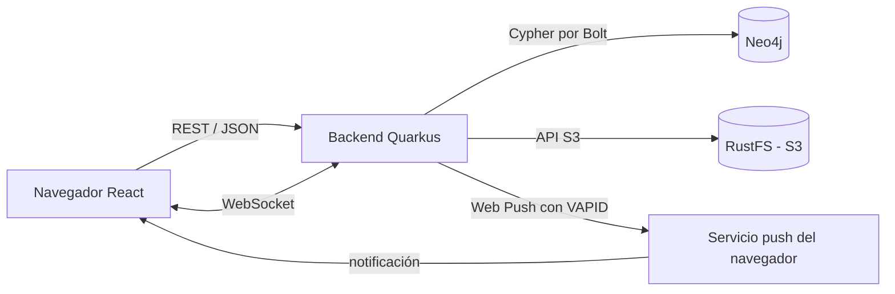

# Diagrama de Arquitectura

## Versión Mermaid (para el README)

## Descripción para crear en draw.io

Crea un diagrama con los siguientes componentes y conexiones:

### Componentes:
1. **Navegador React** (Usuario)
   - Puerto: 80 (nginx) / 5173 (dev)
   - Protocolo: HTTP

2. **Backend Quarkus** (Java 21)
   - Puerto: 8080
   - Protocolo: HTTP REST, WebSocket

3. **Neo4j** (Base de datos de grafos)
   - Puertos: 7474 (HTTP), 7687 (Bolt)
   - Protocolo: Bolt / Cypher

4. **RustFS** (Almacenamiento S3)
   - Puertos: 9000 (API), 9001 (Consola)
   - Protocolo: S3 API

5. **Servicio Push del navegador** (FCM/Chrome Push Service)
   - Protocolo: Web Push con VAPID

### Conexiones:
- Navegador → Backend: REST/JSON (autenticación con JWT)
- Navegador ↔ Backend: WebSocket (chat en tiempo real)
- Backend → Neo4j: Cypher por protocolo Bolt
- Backend → RustFS: API S3 (subida/descarga de imágenes)
- Backend → Servicio Push: Web Push cifrado con VAPID
- Servicio Push → Navegador: Notificaciones push

### Arquitectura de capas:
- **Frontend**: React + Vite + nginx
- **Backend**: Quarkus + Java 21
- **Datos**: Neo4j (grafo) + RustFS (archivos)
- **Infraestructura**: Docker Compose
